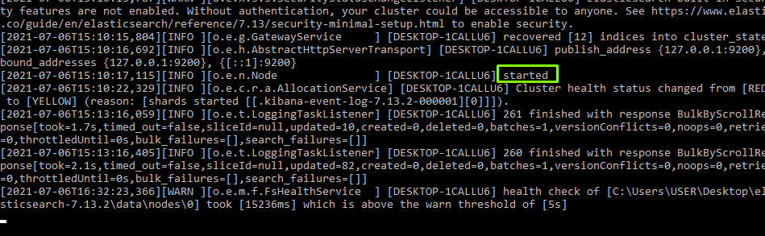

> This project is the first round of my chat app development


# Inbar`s chat room

### Welcome

Welcome to my chat room. 
In this chat room you can post new questions, answer to other users questions and also get a smart answer from my bot.
my bot will find previous answer for similar question and give you the best answer from google.
Enjoy!


   
### Prerequisites

- [node.js](https://nodejs.org)

    Furthermore, this project is built on [JavaScript](https://javascript.info/) with the intention of improving the developer experience.

    
 - [elasticsearch](https://www.elastic.co/elasticsearch/)
 
    Download elasticSearch from the link above.
    After pressing the download button, a compressed file will be download to your computer, extract it.
    
    
    Kibana (https://www.elastic.co/kibana/) is recommended as well
    


## Quick start

    
####  load Elasticsearch
Open a new CMD Terminal.
At the elastic search file you downloaded, go to bin file
```
cd /path/to/bin
```

then run 
```
elasticsearch
```

Wait until elasticsearch finished loading



#### Install the dependencies

Open a new CMD Terminal

go to the main folder of this project and run:

```
SET PATH=C:\Program Files\Nodejs;%PATH%

 npm install

```
    
####  Load the Server
Open a new CMD Terminal
```
cd /path/to/server
node server
```

#### Start the development server

go back to the main folder of this project and run:

    npm start
    

    
### Now Let's get started!
Open your browser at `http://localhost:8000`
